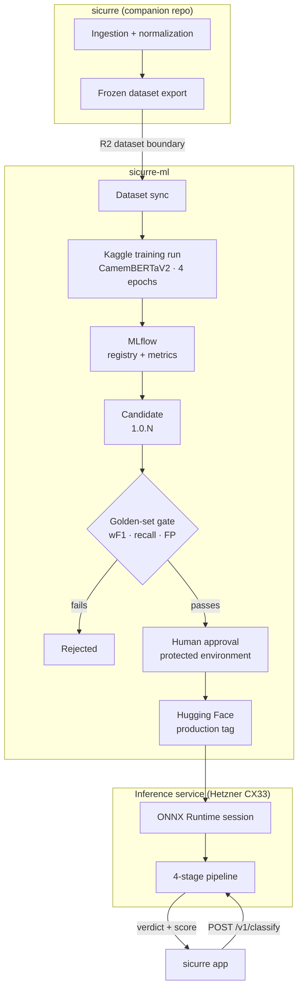
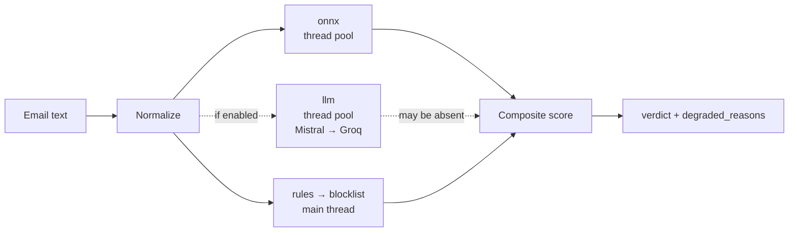

<div align="center">

# Sicurre&nbsp;ML

**Three-class French email classifier: phishing · spam · legitimate**

Training pipeline, evaluation gates, and the ONNX inference service behind
[Sicurre](https://github.com/MichAdebayo/sicurre).

[](https://github.com/MichAdebayo/sicurre-ml/actions/workflows/ci.yml)
[](https://github.com/MichAdebayo/sicurre-ml/actions/workflows/cd.yml)
[](pyproject.toml)
[](docs/adr/0001-camembertv2-as-base-model.md)
[](src/inference/onnx_classifier.py)
[](docs/adr/0004-mlflow-for-tracking.md)
[](docs/model/promotion-policy.md)

</div>

---

## What this repo is

`sicurre-ml` owns **everything about the model** and nothing about the
application. It consumes frozen dataset exports produced by the companion
`sicurre` repo, trains a classifier, gates it against an immutable golden set,
and serves the approved artifact over an authenticated HTTP API.

| This repo owns | This repo does **not** own |
|----------------|----------------------------|
| Training configuration and metrics | Email ingestion and normalization |
| Evaluation and promotion gates | Dataset creation and lineage |
| MLflow tracking, HF publication | Application runtime and user data |
| The ONNX inference service | Remediation and notifications |

R2 is the dataset boundary between the two repos. Kaggle is the packaged
execution environment for training runs.

## System architecture



### The four-stage inference pipeline

A request is scored by four independent stages whose outputs are combined into
one weighted composite score.



`onnx` and `llm` are each submitted to their own thread pool; `rules` and then
`blocklist` run sequentially on the main thread while those are in flight, and
the futures are joined before the composite is formed.

The service **is instrumented**: `/v1/classify` emits a structured log line per
request (`emit_classify_request_log`) carrying `latency_ms` and
`stage_latencies_ms`, shipped by Grafana Alloy and rendered as p95 latency,
error rate, degraded decisions, and provider usage. What is not yet established
is whether observed traffic is representative. Alert thresholds, configurable
timeouts, and measured latency describe different things. They do not establish
a customer-facing latency guarantee.

`blocklist` checks two local sources: the PhishTank set ingested by the data
platform, and `FRENCH_DARK_DOMAINS`, a curated set of French impersonation
patterns for institutions and brands that phishing campaigns imitate. Both are
in-process lookups. VirusTotal enrichment is opt-in per request
(`use_virustotal`, default `false`) and makes a live API call with a 10 s
timeout, so it materially changes latency when enabled.

The LLM stage is dispatched to a thread pool and joined before scoring, so it
gates total latency. **When the whole provider chain fails, the pipeline records
`llm_unavailable` and still returns a verdict from the remaining stages.** The
service keeps working when the providers do not.

Groq serves `openai/gpt-oss-*`, which reason before answering. Reasoning tokens
are drawn from the same `LLM_MAX_OUTPUT_TOKENS` budget as the answer, so a long
enough message exhausts it and the model returns nothing — which Groq rejects as
`json_validate_failed`, a 400 rather than a timeout. The request therefore sends
`reasoning_effort` (`GROQ_REASONING_EFFORT`, default `low`), which bounds the
reasoning and shortens the stage. Provider failures log the response body,
because a bare status code cannot separate an invalid model from an exhausted
budget.

## Performance

Authenticated smoke checks on 2 September 2026 exercised the running local and
production services, both with and without the LLM stage. All 12 timed requests
returned HTTP 200. The measured timings and their limitations are recorded in
[performance and quality](docs/architecture/performance.md), with the individual
observations retained as machine-readable evidence.

These checks demonstrate that the tested inference requests completed. They do
not establish end-to-end email delivery time, sustained capacity, classification
accuracy, or a two-second guarantee. The Cloudflare Email Worker currently
requests LLM-enabled classification, so LLM-disabled timings cannot stand in for
that delivery path.

The configured 8-second alert is an operational threshold, not an SLA. Its
current histogram limitation is documented alongside the measurements.

## API surface

Local reference: start with `DEPLOYMENT_ENV=development make serve-reload`,
then open `http://127.0.0.1:8000/docs` (or `/redoc`). The raw schema is at
`/openapi.json`. These HTTP documentation routes are disabled outside local
development; production Compose explicitly pins `DEPLOYMENT_ENV=production`.
The checked-in contract and `make openapi-check` remain unchanged.

| Method | Path | Auth | Purpose |
|--------|------|------|---------|
| `GET` | `/health`, `/v1/health` | None | Liveness |
| `GET` | `/v1/ready` | None | 200 when model loaded, 503 when not ready |
| `GET` | `/v1/metrics` | Internal network | Plain-text metrics; blocked by the public reverse proxy |
| `POST` | `/v1/classify` | Bearer | Classify an email |
| `GET` | `/v1/manifest` | Bearer | Deployed model identity and LLM provider configuration |

Rate limiting defaults to 1 rps sustained with a burst of 5
(`INFERENCE_RATE_LIMIT_RPS`, `INFERENCE_RATE_LIMIT_BURST`).

The manifest maps the human-readable `model.version` to the loaded immutable
Hugging Face `model.revision`. Service version, training dataset version, and
container digest remain separate identities. See
[deployment identity](docs/architecture/deployment-identity.md).

Its `llm` block reports which providers are configured and which model each is
pinned to, so a misconfigured provider is visible without reading the container
environment. It reports names only, never keys.

## Model and training

| Property | Value |
|----------|-------|
| Base model | `almanach/camembertav2-base` |
| Labels | `phishing=0` · `spam=1` · `legitimate=2` |
| Max sequence length | 256 tokens |
| Epochs | **4**, standardised; see below |
| Batch size · LR | 8 · 2e-5 |
| Class weighting | `inverse_freq` |
| Serving format | ONNX |

**On the epoch count.** Four is the standing choice, matching the budget the
incumbent was trained with. A three-epoch candidate on the 1 September corpus
measured worse: weighted F1 0.7141 against 0.8515, with
phishing recall identical at 0.8810 and legitimate false positives rising from
8 to 20 (reported McNemar p = 0.0018). This comparison does not isolate epoch
count as the cause. Changes to training settings require a controlled comparison
and the normal promotion evaluation.

## Promotion

Training and promotion are **separate operations**. A finished run publishes an
immutable candidate and never advances a production pointer on its own.

1. Register in MLflow, alias `candidate`
2. Export ONNX, upload to Hugging Face, resolve the immutable commit SHA
3. Evaluate candidate *and* incumbent on the **same** golden-set version
4. Write a machine-readable promotion manifest
5. Passing evaluation invokes promotion; a human reviews evidence and approves the `production` environment when required reviewers are configured
6. Move MLflow alias and HF tag, pin and restart the server, validate, callback

Failure handling attempts restoration of the preserved production pointers and
records the outcome. Recovery must be verified, not assumed. Full policy:
[docs/model/promotion-policy.md](docs/model/promotion-policy.md).

## Repository layout

| Path | Responsibility |
|------|----------------|
| `src/config/` | Training configuration, label constants |
| `src/data/` | Dataset loading, schema validation, tokenization |
| `src/model/` | Model loading, class weighting, trainer, metrics |
| `src/training/` | Training entrypoints |
| `src/evaluation/` | Golden-set registry, reports, error analysis |
| `src/inference/` | Four-stage pipeline, ONNX session, LLM chain |
| `src/serving/` | FastAPI app, auth, rate limiting |
| `src/registry/` | MLflow logging, Hugging Face publication |
| `deploy/` | Compose files, nginx, Grafana Alloy |
| `docs/` | Architecture, ADRs, runbooks; [index](docs/README.md) |

## Quickstart

```bash
uv sync
```

```bash
uv run pytest -q
```

```bash
uv run uvicorn src.serving.app:app --reload --port 8000
```

## Workflows

| Workflow | Trigger | Purpose |
|----------|---------|---------|
| `ci.yml` | PR, push | Lint, type-check, tests, coverage gate |
| `cd.yml` | Successful CI on `main`, or manual dispatch | Build image, deploy to Hetzner |
| `train.yml` | Dispatch; selected `mlops` pushes validate only | Validate lineage; real dispatch syncs data and runs Kaggle training |
| `evaluate-model.yml` | After training | Golden-set gate, candidate vs incumbent |
| `promote-model.yml` | Manual dispatch or reusable workflow call with promotion evidence | Move production pointers, validate, callback |
| `release.yml` | Push to `main` | Prepare or publish a service release through release-please |

## Documentation

| Area | Entry point |
|------|-------------|
| Docs index | [docs/README.md](docs/README.md) |
| **Performance and quality** | [docs/architecture/performance.md](docs/architecture/performance.md) |
| Deployment identity | [docs/architecture/deployment-identity.md](docs/architecture/deployment-identity.md) |
| Promotion policy | [docs/model/promotion-policy.md](docs/model/promotion-policy.md) |
| Monitoring design | [docs/architecture/monitoring-design.md](docs/architecture/monitoring-design.md) |
| Architecture decisions | [docs/adr/](docs/adr/) |
| Runbooks | [docs/ops/](docs/ops/) |
| Deployment | [deploy/README.md](deploy/README.md) |
