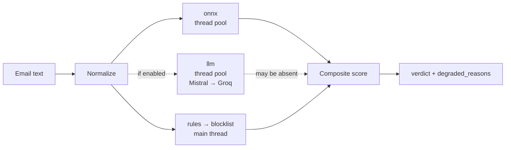

<div align="center">

# Sicurre&nbsp;ML

**Three-class French email classifier — phishing · spam · legitimate**

Training pipeline, evaluation gates, and the ONNX inference service behind
[Sicurre](https://github.com/MichAdebayo/sicurre).

[](https://github.com/MichAdebayo/sicurre-ml/actions/workflows/ci.yml)
[](https://github.com/MichAdebayo/sicurre-ml/actions/workflows/cd.yml)
[](pyproject.toml)
[](docs/adr/0001-camembertv2-as-base-model.md)
[](src/inference/onnx_classifier.py)
[](docs/adr/0004-mlflow-for-tracking.md)
[](docs/model/promotion-policy.md)

</div>

---

## What this repo is

`sicurre-ml` owns **everything about the model** and nothing about the
application. It consumes frozen dataset exports produced by the companion
`sicurre` repo, trains a classifier, gates it against an immutable golden set,
and serves the approved artifact over an authenticated HTTP API.

| This repo owns | This repo does **not** own |
|----------------|----------------------------|
| Training configuration and metrics | Email ingestion and normalization |
| Evaluation and promotion gates | Dataset creation and lineage |
| MLflow tracking, HF publication | Application runtime and user data |
| The ONNX inference service | Remediation and notifications |

R2 is the dataset boundary between the two repos. Kaggle is the packaged
execution environment for training runs.

## System architecture


### The four-stage inference pipeline

A request is scored by four independent stages whose outputs are combined into
one weighted composite score.



`onnx` and `llm` are each submitted to their own thread pool; `rules` and then
`blocklist` run sequentially on the main thread while those are in flight, and
the futures are joined before the composite is formed.

The service **is instrumented**: `/v1/classify` emits a structured log line per
request (`emit_classify_request_log`) carrying `latency_ms` and
`stage_latencies_ms`, shipped by Grafana Alloy and rendered as p95 latency,
error rate, degraded decisions, and provider usage. What is not yet established
is whether observed traffic is representative or whether the targets below are
attained over a full window — they were set from deployed alert thresholds and
enforced timeouts, not derived from production distribution.

`blocklist` checks a local PhishTank set by default. VirusTotal enrichment is
opt-in per request (`use_virustotal`, default `false`) and makes a live API call
with a 10 s timeout, so it materially changes latency when enabled.

The LLM stage is dispatched to a thread pool and joined before scoring, so it
gates total latency. **When the whole provider chain fails, the pipeline records
`llm_unavailable` and still returns a verdict from the remaining stages.** The
service keeps working when the providers do not.

## Performance

**Two seconds, end to end.** That is the commitment on the homepage, and the
measurements support it with room to spare.

An email reaches a verdict through three hops — Cloudflare Email Worker →
`sicurre /v1/email/scan` → `sicurre-ml /v1/classify`. Measured 2 September 2026
against the production model (v15):

| What | Median | Notes |
|------|--------|-------|
| `/v1/email/scan` hop | 393 ms | From a laptop over the public internet |
| `/v1/classify` hop, all four stages | 426 ms | From a laptop over the public internet |
| Classification compute alone | **3 ms** | No network; 36 ms p95 |
| `rules` / `blocklist` stages | 0.001 ms | In-process |

Adding the two internet hops naively gives **≈ 820 ms — under half the budget**,
and that is the pessimistic reading. Roughly 250–400 ms of each is laptop-to-
Germany round trip; the real path runs from Cloudflare's edge and then across a
single machine. The work itself is three milliseconds.

The exception is the LLM stage, allowed 7.5 s (Mistral then Groq). It is not
meant to fit two seconds — it is the slower second opinion, and fast requests
run with `use_llm=false`.

Full detail, including what the number 8 in the alerts actually means, is in
[performance and quality](docs/architecture/performance.md).

## API surface

| Method | Path | Auth | Purpose |
|--------|------|------|---------|
| `GET` | `/health`, `/v1/health` | — | Liveness |
| `GET` | `/v1/ready` | — | 200 when model loaded, 503 while downloading |
| `GET` | `/v1/metrics` | — | Plain-text metrics |
| `POST` | `/v1/classify` | Bearer | Classify an email |
| `GET` | `/v1/manifest` | Bearer | Deployed model identity |

Rate limiting defaults to 1 rps sustained with a burst of 5
(`INFERENCE_RATE_LIMIT_RPS`, `INFERENCE_RATE_LIMIT_BURST`).

## Model and training

| Property | Value |
|----------|-------|
| Base model | `almanach/camembertav2-base` |
| Labels | `phishing=0` · `spam=1` · `legitimate=2` |
| Max sequence length | 256 tokens |
| Epochs | **4** — standardised; see below |
| Batch size · LR | 8 · 2e-5 |
| Class weighting | `inverse_freq` |
| Serving format | ONNX |

**On the epoch count.** Four is the standing choice, matching the budget the
incumbent was trained with so candidates are comparable rather than
systematically undertrained. Three was tried on the 1 September corpus and
measured *significantly worse*: weighted F1 0.7141 against 0.8515, with
phishing recall identical at 0.8810 and legitimate false positives rising from
8 to 20 (McNemar p = 0.0018). Detection was unchanged; discrimination
collapsed. Do not lower it without repeating that measurement.

## Promotion

Training and promotion are **separate operations**. A finished run publishes an
immutable candidate and never advances a production pointer on its own.

1. Register in MLflow, alias `candidate`
2. Export ONNX, upload to Hugging Face, resolve the immutable commit SHA
3. Evaluate candidate *and* incumbent on the **same** golden-set version
4. Write a machine-readable promotion manifest
5. Human approves the protected `production` environment — the single manual act
6. Move MLflow alias and HF tag, pin and restart the server, validate, callback

Any post-approval failure restores every preserved pointer and sends a
`rolled_back` callback. Full policy: [docs/model/promotion-policy.md](docs/model/promotion-policy.md).

## Repository layout

| Path | Responsibility |
|------|----------------|
| `src/config/` | Training configuration, label constants |
| `src/data/` | Dataset loading, schema validation, tokenization |
| `src/model/` | Model loading, class weighting, trainer, metrics |
| `src/training/` | Training entrypoints |
| `src/evaluation/` | Golden-set registry, reports, error analysis |
| `src/inference/` | Four-stage pipeline, ONNX session, LLM chain |
| `src/serving/` | FastAPI app, auth, rate limiting |
| `src/registry/` | MLflow logging, Hugging Face publication |
| `deploy/` | Compose files, nginx, Grafana Alloy |
| `docs/` | Architecture, ADRs, runbooks — [index](docs/README.md) |

## Quickstart

```bash
uv sync
```

```bash
uv run pytest -q
```

```bash
uv run uvicorn src.serving.app:app --reload --port 8000
```

## Workflows

| Workflow | Trigger | Purpose |
|----------|---------|---------|
| `ci.yml` | PR, push | Lint, type-check, tests, coverage gate |
| `cd.yml` | Push to `main` | Build image, deploy to Hetzner |
| `train.yml` | Dispatch, dataset callback | Sync dataset, run Kaggle training |
| `evaluate-model.yml` | After training | Golden-set gate, candidate vs incumbent |
| `promote-model.yml` | Approval | Move production pointers, validate, callback |
| `release.yml` | Tag | Service release |

## Documentation

| Area | Entry point |
|------|-------------|
| Docs index | [docs/README.md](docs/README.md) |
| **Performance and quality** | [docs/architecture/performance.md](docs/architecture/performance.md) |
| Promotion policy | [docs/model/promotion-policy.md](docs/model/promotion-policy.md) |
| Monitoring design | [docs/architecture/monitoring-design.md](docs/architecture/monitoring-design.md) |
| Architecture decisions | [docs/adr/](docs/adr/) |
| Runbooks | [docs/ops/](docs/ops/) |
| Deployment | [deploy/README.md](deploy/README.md) |
